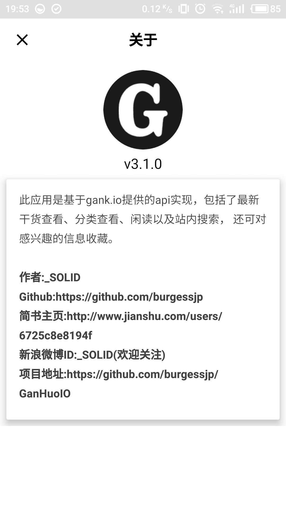

一个基于Gank.IO提供的API的第三方客户端，基于 Material Design，项目中覆盖了 MVP、RxJava、Retrofit、第三方登录以及很多第三方库的使用。App可以及时的查看gank.io的最新更新，还有可以很方便的对信息进行分类查看，可以对感觉有兴趣的信息进行在线收藏。

###应用截图





下载地址:[Fir.im](http://fir.im/ganhuoio)、[应用宝](http://android.myapp.com/myapp/detail.htm?apkName=ren.solid.ganhuoio)


###**更新日志**
- 3.0.5 修复首页显示不全以及部门小米机型异常退出问题
- 3.0.2 优化
      - 减轻由于OOM引起的App异常退出
- 3.0.1 修复
      - 部分手机网络不好异常退出
      - 查看大图崩溃问题
- 3.0.0
     - 1.UI风格大调整，全新的 UI 风格
     - 2.支持干货配图
     - 3.新增 gank 最近推出的闲读
     - 4.新增搜索
     - 5.修复仅Wifi加载图片的bug
     - 6.行为更改：长按干货收藏
- 2.0.1  解决应用启动白屏的问题
- 2.0.0  改变主界面UI，增强用户体验
- 1.3.0  重构底层网络请求，项目使用 RxJava + Retrofit + MVP
- 1.2.0  加入图片摇一摇
- 1.1.0  
   - 1.增加Rx的操作符查询
   - 2.显示来源网站图标，让来源一目了然
   - 3.加入Bomb检测APP更新
- 1.0.3  修复部分手机登录异常退出
- 1.0.2  Fix Issues 1,增加反馈功能
- 1.0.1  修复登录异常
- 1.0.0  发布

###感谢
[daimajia](https://github.com/daimajia)、[drakeet](https://github.com/drakeet)、[Android-Proficiency-Exercise](https://github.com/ryanhoo/Android-Proficiency-Exercise)

###License
```html
Copyright (C) 2016 [_SOLID](https://github.com/burgessjp)

Licensed under the Apache License, Version 2.0 (the "License");
you may not use this file except in compliance with the License.
You may obtain a copy of the License at

    http://www.apache.org/licenses/LICENSE-2.0

Unless required by applicable law or agreed to in writing, software
distributed under the License is distributed on an "AS IS" BASIS,
WITHOUT WARRANTIES OR CONDITIONS OF ANY KIND, either express or implied.
See the License for the specific language governing permissions and
limitations under the License.
```